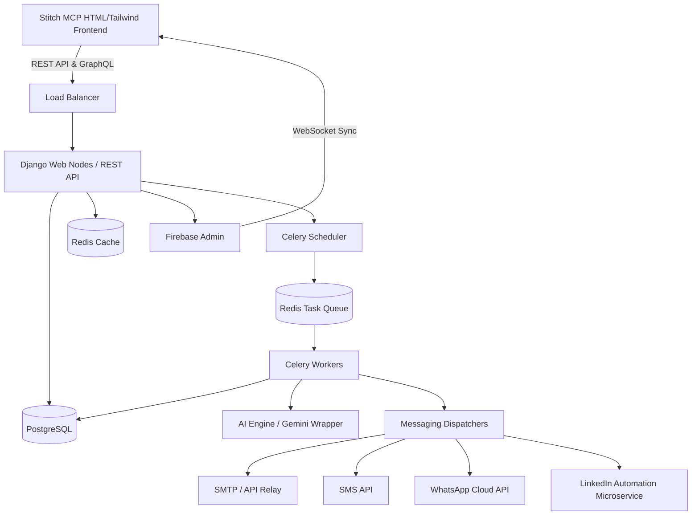

# System Architecture

## 1. High-Level Component Diagram

The Lime outreach platform is built on an event-driven, async-first architecture specifically designed for horizontal scalability and strict tenant isolation.

## 2. Core Architectural Components

### Presentation Layer
- **Tech Stack**: HTML, CSS (Tailwind), Vanilla JS/Alpine.js. Generated dynamically via Stitch MCP templates.
- **Real-Time Data**: Firebase SDK integrated on the client to listen to document changes (e.g., campaign progress updates, live notifications) without polling the Django API.

### Application Layer (Django API)
- **Role**: Handles HTTP requests, authentication, business logic, tenant validation, and task queuing.
- **Multi-Tenancy**: Shared database, separated by schemas or strict `organization_id` foreign keys (enforced by TenantMiddleware).
- **Statelessness**: No session data stored on web nodes to allow instant horizontal scaling via auto-scaling groups.

### Queue & Event Engine
- **Broker**: Redis.
- **Workers**: Celery. Separated by queue types (`dispatch_queue`, `import_queue`, `webhook_queue`, `ai_queue`, `analytics_queue`) to prevent bulk CSV imports from blocking time-sensitive email dispatches.
- **State Machine**: The `CampaignLead` represents the state. The `CeleryBeat` scheduler constantly queries the database for `CampaignLead` records where `status='ACTIVE'` and `next_execution_time <= NOW()`.

### AI Context Layer
- **Wrapper**: An internal microservice/class that standardizes prompts.
- **Pipeline**: Fetch Lead Data → Build Prompt Context → Execute Gemini API Call → Fallback Check → Save Output.
- **Resilience**: Implements exponential backoff, rate limit handling, and deterministic string fallbacks if the AI provider times out.

### Message Delivery
- Pluggable strategies for dispatchting messages.
- Idempotency keys generated per `Message` to ensure retries by Celery workers do not result in double-emails to leads.
- Delivery webhooks from providers (e.g., SendGrid/Mailgun Event Webhooks) are routed back to Django, placed on the `webhook_queue`, and processed asynchronously to update lead analytics.
